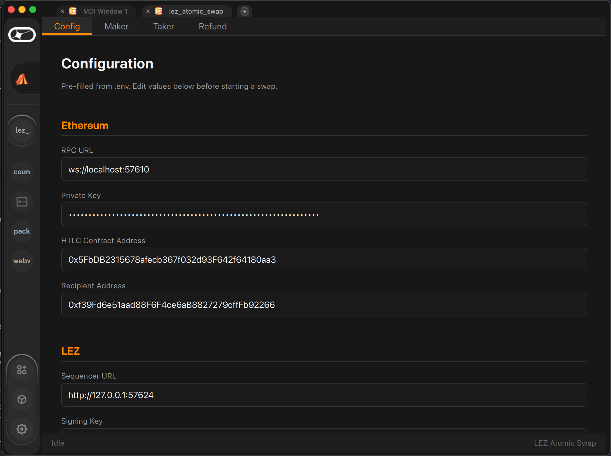
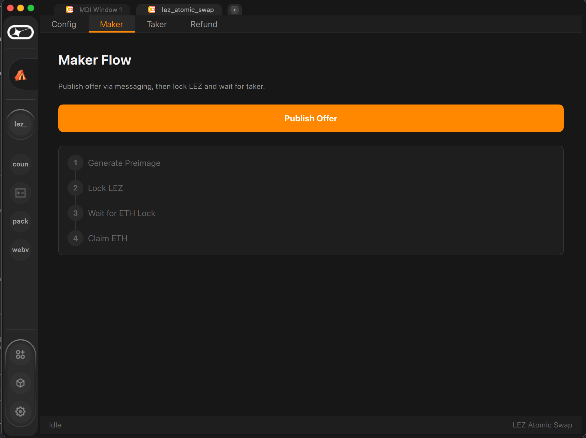
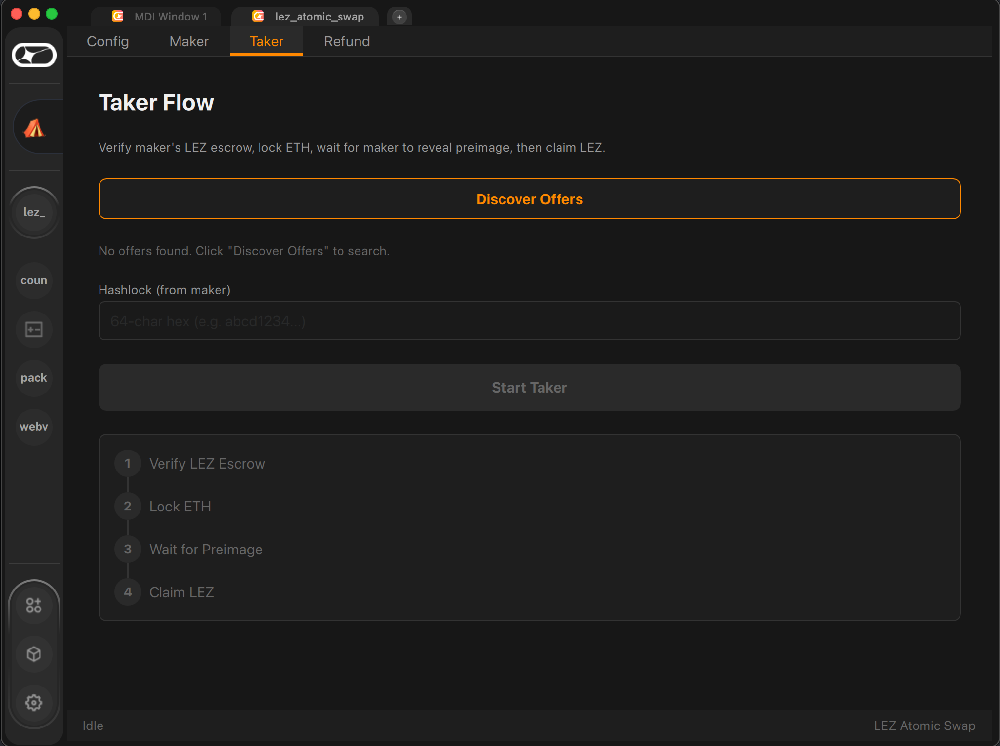
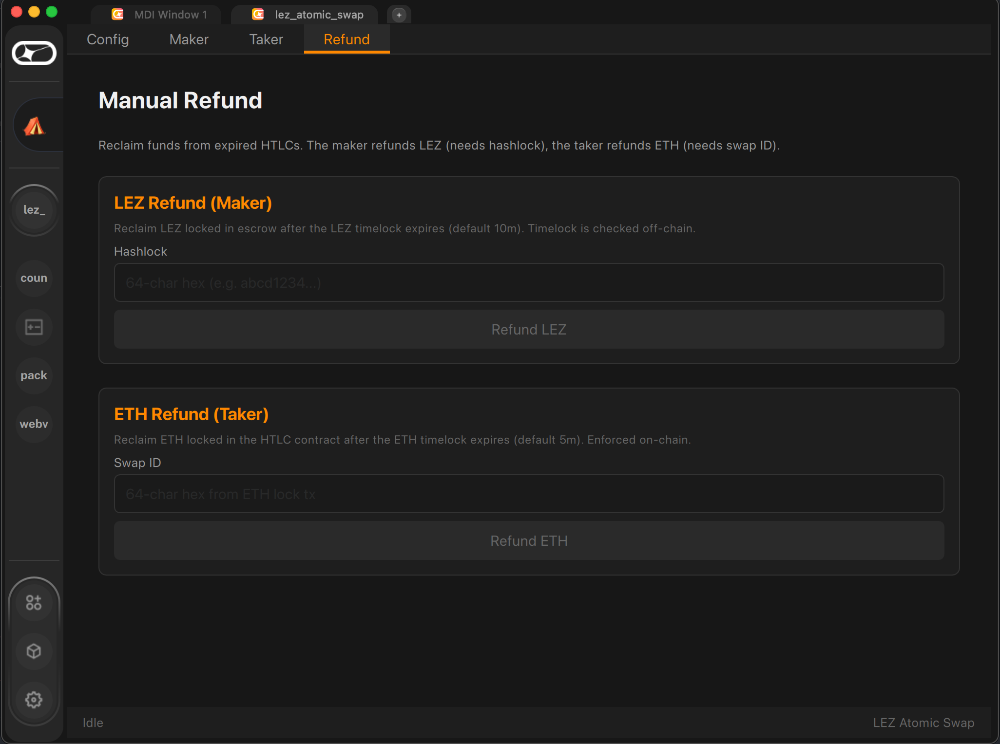
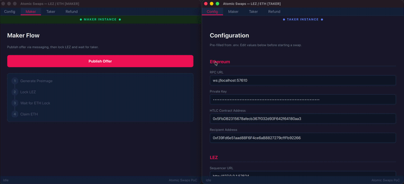

# Atomic Swaps PoC

Cross-chain atomic swap between LEZ and Ethereum using hash time-locked contracts (HTLCs). Maker sells LEZ for ETH — both sides are trustless with timeout refunds.

```
Taker                                          Maker
  |  1. Generate preimage + hashlock            |
  |  2. Lock ETH (long timelock)                |
  |─────────── ETH Locked event ─────────────>|
  |                                 3. Verify ETH lock, lock LEZ (short timelock)
  |  4. Claim LEZ (reveals preimage)            |
  |                                 5. Learn preimage, claim ETH
```

## Screenshots

**Standalone UI** (maker + taker side-by-side):


**logos-app plugin:**

| Config | Maker | Taker | Refund |
|--------|-------|-------|--------|
|  |  |  |  |



## Quick Start

**Prerequisites:** Rust 1.85+, Foundry, CMake 3.21+, Qt 6.5+, GNU make + a C/C++ toolchain (for `libwaku`), [`logos-scaffold`](https://github.com/logos-co/logos-scaffold).

> The Logos messaging node (`libwaku`) is now embedded in-process — there is no Docker dependency. The first build compiles the Nim-based `libwaku` from source (5–10 min) via `waku-sys`'s vendored `nimbus-build-system`; subsequent builds are cached. See [delivery-dogfooding.md](delivery-dogfooding.md) for integration notes.

<details><summary><b>macOS</b></summary>

```bash
brew install qt@6 cmake
curl --proto '=https' --tlsv1.2 -sSf https://sh.rustup.rs | sh
curl -L https://foundry.paradigm.xyz | bash && foundryup
```
If CMake can't find Qt6: `export CMAKE_PREFIX_PATH="$(brew --prefix qt@6)"`. The workspace `.cargo/config.toml` already supplies the macOS aarch64 linker flags `libwaku` needs.
</details>

<details><summary><b>Linux (Ubuntu/Debian)</b></summary>

```bash
# Ubuntu / Debian
sudo apt install cmake qt6-base-dev qt6-declarative-dev build-essential
# Fedora
sudo dnf install cmake qt6-qtbase-devel qt6-qtdeclarative-devel gcc gcc-c++ make
curl --proto '=https' --tlsv1.2 -sSf https://sh.rustup.rs | sh
curl -L https://foundry.paradigm.xyz | bash && foundryup
```
Qt 6.5+ required — Ubuntu 24.10+ ships it. For older distros use [aqtinstall](https://github.com/miurahr/aqtinstall) or the [Qt online installer](https://www.qt.io/download-qt-installer).
</details>

```bash
git clone --recurse-submodules https://github.com/logos-co/eth-lez-atomic-swaps.git
cd eth-lez-atomic-swaps
```

> Already cloned without `--recurse-submodules`? Run `git submodule update --init --recursive`.

### 1. Setup & Infrastructure

```bash
make setup                # one-time: fetches logos-blockchain-circuits, creates scaffold wallet at .scaffold/wallet
make infra                # starts Anvil, LEZ sequencer, embedded waku rendezvous node;
                          # deploys contracts; writes .env files. Keeps running — Ctrl-C to stop.
```

> Under the hood, `make infra` shells out to `logos-scaffold` for LEZ-side work: `localnet start` to boot the sequencer (and `localnet stop` on Ctrl-C), plus `wallet topup` to fund the maker and taker accounts. Anvil, contract deployment, and the embedded waku rendezvous node are managed directly by the orchestrator. The rendezvous node's multiaddr is written into `.env` / `.env.taker` as `WAKU_BOOTSTRAP_MULTIADDR` so each CLI/UI process spawns its own node and dials in.

> **Circuits:** `make setup` downloads `logos-blockchain-circuits` v0.4.2 into `.scaffold/circuits/` and exports `LOGOS_BLOCKCHAIN_CIRCUITS` so it does not touch any pre-existing `~/.logos-blockchain-circuits/` on your machine (which may be pinned to a different version by another Logos install). Every `make` target that builds or runs Rust inherits the env var, so lssa and cargo build scripts both pick up the project-local copy. Bump `CIRCUITS_VERSION` at the top of the `Makefile` when the lssa pin in `scaffold.toml` requires a newer release. Note: upstream does not publish a `macos-x86_64` build, so Intel Macs are unsupported.

### 2. Pick an Interface

Open a new terminal and choose one:

**Standalone UI**
```bash
make run-maker            # builds FFI bridge + UI on first run, opens maker UI
make run-taker            # opens taker UI (in another terminal)
```

**logos-app plugin**

Runs inside [logos-app](https://github.com/logos-co/logos-app) as an IComponent plugin. Requires Nix (for building logos-app) and the logos-app Qt 6.9 libraries (the plugin must link against the same Qt that logos-app ships).

<details><summary><b>First-time logos-app setup</b></summary>

```bash
git clone https://github.com/logos-co/logos-app.git
cd logos-app
nix build            # builds the app via flake.nix — produces result/bin/logos-app
```

The Makefile expects logos-app at `~/Developer/status/logos-app`. If yours is elsewhere, override:

```bash
make plugin-build LOGOS_APP_INTERFACES=<path-to-logos-app>/app/interfaces
make plugin-run-maker LOGOS_APP_BIN=<path-to-logos-app>/result/bin/logos-app
```

The plugin build uses Nix Qt paths hardcoded in the Makefile (`NIX_QTBASE`, `NIX_QTDECLARATIVE`, etc.). If your Nix store hashes differ, update them — run `nix build` in logos-app first, then find the paths with `nix path-info .#logos-app --recursive | grep qt`.
</details>

```bash
make plugin-run-maker     # builds + installs the plugin on first run, launches logos-app as maker (loads .env)
make plugin-run-taker     # launches logos-app as taker (loads .env.taker, in another terminal)
```

Two logos-app instances are needed — one per role (maker/taker), each with its own wallet credentials. The plugin is installed to `~/Library/Application Support/Logos/LogosAppNix/plugins/lez_atomic_swap/` (macOS).

**How it works:** `make plugin-install` copies the compiled plugin (`lez_atomic_swap.dylib`) and the Rust FFI bridge (`libswap_ffi.dylib`) into the logos-app plugin directory. On launch, logos-app discovers and loads the plugin, which registers a `SwapBackend` QML context object. Config is injected via environment variables from `.env` / `.env.taker`.

**CLI** (no UI)
```bash
# In two terminals:
env $(cat .env | grep -v '^\#' | xargs) cargo run -- maker
env $(cat .env.taker | grep -v '^\#' | xargs) cargo run -- taker

# Or run both sides headlessly in one terminal:
make demo
```

### 3. Run a Swap

**Maker** (any interface): Publish Offer → Start Swap → waits for taker to lock ETH → locks LEZ → waits for preimage → claims ETH.
**Taker** (any interface): Discover Offers → select offer → Start Taker → generates preimage, locks ETH → waits for LEZ lock → claims LEZ.

Verify balances after a swap with the LSSA wallet CLI:
```bash
NSSA_WALLET_HOME_DIR=.scaffold/wallet wallet account ls -l
```

### 4. Cleanup

Stop with `Ctrl-C` on `make infra` — Anvil, the LEZ localnet, and the embedded waku rendezvous node all shut down together.

## Architecture

```
┌──────────────────┬──────────────────┐
│  Qt6 UI (ui/)    │ logos-app plugin  │
│  standalone app  │ (logos-module/)   │
├──────────────────┴──────────────────┤
│       swap-ffi (C bridge / cdylib)  │
├─────────────────────────────────────┤
│      Swap orchestration library     │
├─────────────────────────────────────┤
│     Chain monitoring + Messaging    │
├─────────────────┬───────────────────┤
│   alloy (ETH)   │   nssa_core (LEZ) │
└─────────────────┴───────────────────┘
```

| Directory | Description |
|---|---|
| `contracts/` | Solidity HTLC (Foundry) — `lock()`, `claim()`, `refund()` with SHA-256 hashlock |
| `programs/lez-htlc/` | LEZ HTLC program (Risc0 zkVM) — same logic, escrow in PDA |
| `src/` | Orchestration library — ETH/LEZ clients, watchers, messaging, scaffold integration, maker/taker/refund flows |
| `swap-ffi/` | C FFI bridge exposing swap functions to the Qt6 UI |
| `ui/` | Qt6/QML standalone app — Config, Maker, Taker, Refund tabs |
| `logos-module/` | logos-app IComponent plugin + standalone app (same UI, two build modes) |
| `tests/` | Integration tests |

## Commands

| Command | Description |
|---|---|
| `make setup` | One-time scaffold wallet setup (creates `.scaffold/wallet`) |
| `make infra` | Start Anvil, LEZ localnet, embedded waku rendezvous node; deploy HTLCs on both chains; write `.env` files |
| `make configure` | Build the Rust FFI bridge + run cmake configure for the Qt6 standalone app |
| `make build` | Build the Qt6 standalone UI |
| `make run-maker` / `run-taker` | Launch the standalone maker/taker UI (loads `.env` / `.env.taker`) |
| `make demo` | Run the full swap headlessly — no UI needed |
| `make test` | Build contracts, start localnet, run all tests, stop localnet |
| `make contracts` | Build Solidity contracts via Foundry |
| `make localnet-start` / `localnet-stop` | Start/stop LEZ localnet via `logos-scaffold` |
| `make plugin-build` | Build the Rust FFI bridge + IComponent plugin for logos-app |
| `make plugin-run-maker` / `plugin-run-taker` | Launch logos-app as maker/taker (two instances needed) |
| `make logos-module-build` / `logos-module-run` | Build / run as standalone app (no logos-app needed) |
| `make clean` | Clean Qt6 UI build artifacts |

**CLI** (config via `.env` or CLI flags — see `.env.example`):

```bash
swap-cli maker                         # publish offer, wait for ETH lock, lock LEZ, claim ETH
swap-cli taker                         # discover offer, generate preimage, lock ETH, claim LEZ
swap-cli refund lez --hashlock <hex>    # refund LEZ after timelock
swap-cli refund eth --swap-id <hex>     # refund ETH after timelock
swap-cli infra                          # start Anvil + LEZ sequencer + embedded waku, deploy, write .env
swap-cli demo                           # run full swap headlessly (maker + taker)
```

## Design Notes

- **SHA-256 hashlock** (not keccak) — cross-chain compatibility with LEZ's `risc0_zkvm::sha`
- **Taker locks first** — taker generates the secret preimage, locks ETH with a longer timelock; maker locks LEZ with a shorter timelock after verifying the ETH lock
- **LEZ timelock is enforced on-chain** — the HTLC program attaches `TimestampValidityWindow` (LSSA PRs #400/#404) to the Refund output, so the runtime rejects refund transactions whose block timestamp is before the timelock. The orchestrator's pre-submit wall-clock check is a UX optimization that avoids wasted proof generation
- **LEZ escrow is two-step** — Lock (claim PDA + metadata) then Transfer (fund PDA), due to LSSA balance rules
- **Scaffold wallet** — LEZ keys managed by `logos-scaffold`; the orchestration library reads signing keys from the scaffold wallet on disk
- **Messaging is embedded** — every process (`make infra` rendezvous node, CLI maker/taker, FFI consumers) spawns a `libwaku` node in-process via [`waku-bindings`](https://github.com/logos-messaging/logos-delivery-rust-bindings) and joins a single gossipsub mesh. No Docker. Messaging stays optional — the swap logic works without it via manual hashlock exchange. See [delivery-dogfooding.md](delivery-dogfooding.md) for integration friction notes
