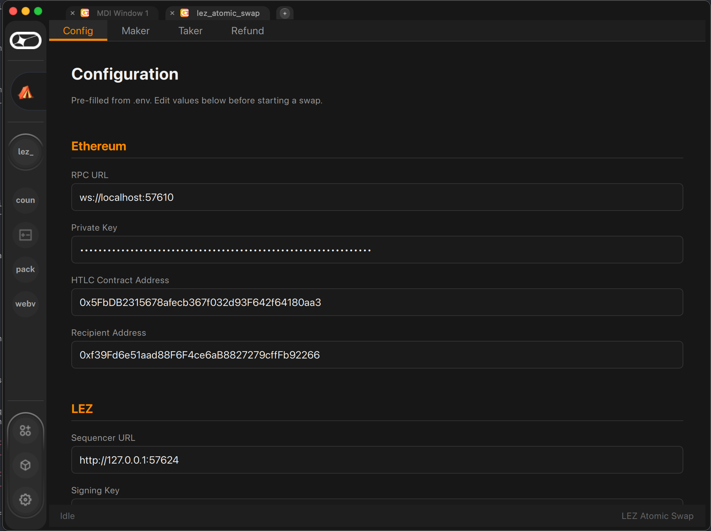
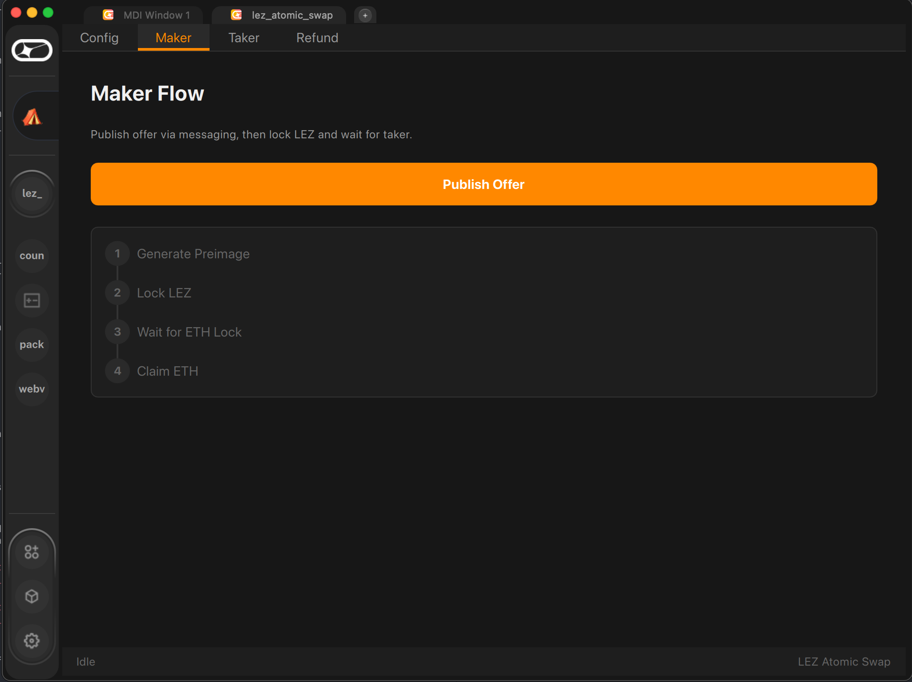
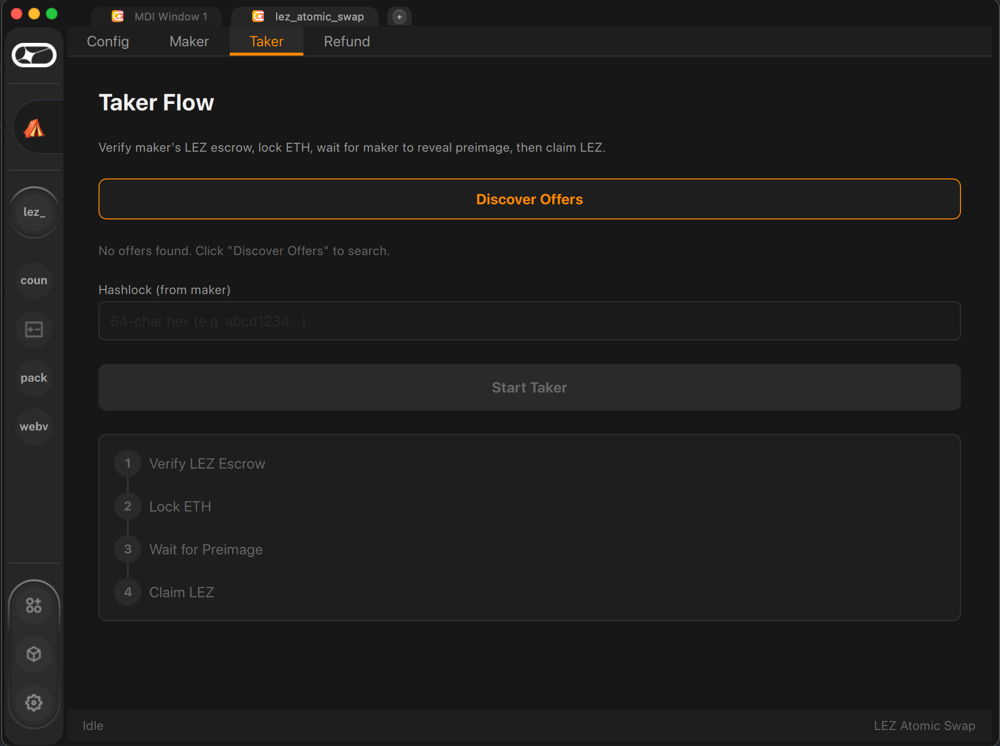
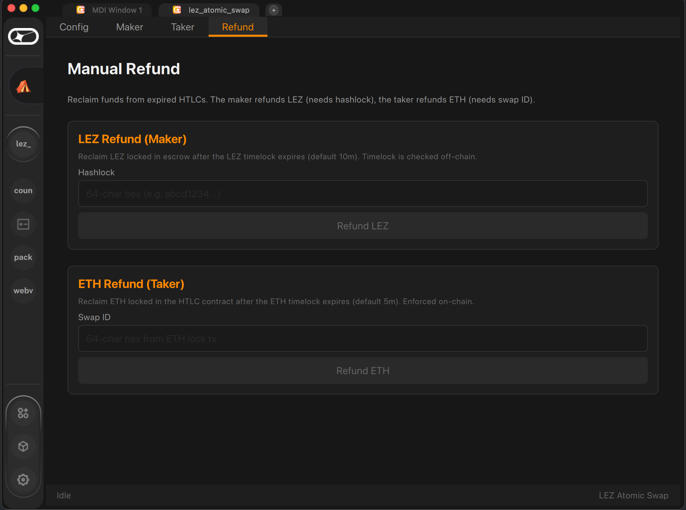
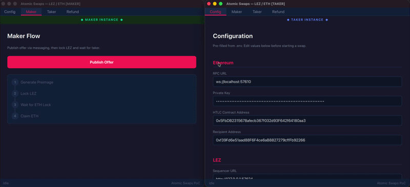

# Atomic Swaps PoC

Cross-chain atomic swap between LEZ and Ethereum using hash time-locked contracts (HTLCs).

This repo includes:

- a Basecamp UI app for the default manual maker/taker flow
- a headless local demo
- a CLI for maker, taker, status, and refund flows

## Default: Local Checks

Run setup once from the repo root:

```bash
lgs setup
```

For the headless demo swap and the test suite, use:

```bash
make demo-makefile
make test-makefile
```

`make demo-makefile` runs `LEE_WALLET_HOME_DIR=.scaffold/wallet cargo run --features demo -- demo`: it starts its own scaffold localnet, deploys the LEZ HTLC program, starts Anvil, deploys the Ethereum HTLC, completes a full swap headlessly, and tears the localnet down. `make test-makefile` runs the contracts + localnet + `cargo test` flow.

> **Note — `lgs run` profiles are currently blocked in this repo.** The scaffold-native `make demo` / `make test` wrappers call `lgs run --profile demo` / `--profile test`, but `lgs run` does not work here today. Its deploy step hardcodes the deployable-program directory as `<project_root>/methods/guest/src/bin`, while this repo keeps its guest program at `programs/lez-htlc/methods/guest/`, so `lgs run` fails with a missing-deployable-program error. The app's own `demo` binary deploys the LEZ HTLC program itself, so scaffold's deploy step is redundant here anyway. This is filed upstream as [Scaffold issue #237](https://github.com/logos-co/scaffold/issues/237), with fix [PR #239](https://github.com/logos-co/scaffold/pull/239) adding a `deploy = false` toggle on `[run]` / `[run.profiles.<name>]` (default true). Once PR #239 merges into a scaffold release we adopt, adding `deploy = false` to `[run.profiles.demo]` / `[run.profiles.test]` in `scaffold.toml` re-enables `lgs run` for this repo. Until then, use the `-makefile` targets above.

## Manual Basecamp Run

For local manual testing, run two isolated Basecamp peers: one maker and one taker. This flow is scaffold-native — `lgs` owns the module build, the portable Basecamp/LGPM build, and the per-profile install.

Build the module artifacts and set up the portable Basecamp stack once:

```bash
lgs setup
lgs basecamp build
lgs basecamp setup
lgs basecamp install
```

Then start the local chain infrastructure and keep it running:

```bash
make infra
```

In two more terminals, launch the Basecamp peers (see the [macOS launch note](#macos-lgs-basecamp-launch-note) below):

```bash
lgs basecamp launch maker
lgs basecamp launch taker
```

On macOS, launch each peer through the committed launch bridge instead, so each gets an absolute `LOGOS_DATA_DIR` (see the [macOS launch note](#macos-lgs-basecamp-launch-note)):

```bash
scripts/basecamp-launch.sh maker
scripts/basecamp-launch.sh taker
```

What each phase does:

| Command | Why it is needed |
|---|---|
| `lgs setup` | Fetches `logos-blockchain-circuits` v0.4.2 into `.scaffold/circuits` (driven by the `[circuits]` block in [`scaffold.toml`](scaffold.toml)), creates the local LEZ checkout and wallet under `.scaffold/`, and exports `LOGOS_BLOCKCHAIN_CIRCUITS`. |
| `lgs basecamp build` | Runs the aggregate module build, producing the `swap`, `swap_ui`, and `delivery_module` LGX artifacts under `.scaffold/basecamp/{lgx,portable}/`. |
| `lgs basecamp setup` | Builds the portable `bin-macos-app` Basecamp (`a746cdbc` / v0.1.1) and the `cli-portable` LGPM (`e5c25989`), then seeds the two Basecamp profiles. |
| `lgs basecamp install` | Installs the three `#lgx-portable` packages (`delivery_module` + `swap` as modules, `swap_ui` as a plugin) into each profile via `lgpm cli-portable`. The portable Basecamp and `lgpm cli-portable` agree on the bare `darwin-arm64` variant, so the install completes with zero variant errors. |
| `make infra` | Starts Anvil and the LEZ localnet, deploys the ETH HTLC contract, and writes `.env` / `.env.taker`. Keep this running. |
| `lgs basecamp launch maker` / `lgs basecamp launch taker` | Launches the two Basecamp windows with the correct role and env file. |

Re-run `lgs basecamp build` and `lgs basecamp install` after changing the module, UI, or Delivery package inputs so each profile gets the updated LGX packages.

`make infra`, Anvil startup, and the Ethereum HTLC deployment remain app-owned because scaffold does not model an Anvil co-process yet. Use `Ctrl-C` in the `make infra` terminal to stop the local stack.

### Why `[modules.swap]` uses a `git+file:` ref

`scaffold.toml` declares the two project modules with `git+file:` flake refs:

```toml
[modules.swap]
flake = "git+file:.?dir=swap-module#lgx"

[modules.swap_ui]
flake = "git+file:.?dir=swap-ui#lgx"
```

`swap-module` and `swap-ui` are same-repo nested sub-flakes: `swap-ui` depends on `swap-module` via `path:../swap-module`, and `swap-module` builds `swap-ffi` from `path:..` (the repo root). Scaffold's `normalize_flake_ref` absolutizes a `path:./sub` ref to `path:/abs/sub`; Nix then copies that sub-flake to the store standalone, so its transitive `path:..` escapes the copied tree and the build fails with a `/nix/store` path error. A `git+file:.?dir=<sub>` ref is passed through untouched by scaffold — each sub-flake's source becomes the whole committed repo, so the internal `path:..` / `path:../swap-module` references stay in-tree. The flakes themselves are unchanged, so a direct `nix build .#lgx` inside either subdirectory still works.

**Operational implication:** a `git+file:.` ref hashes the whole committed git tree, so any tracked-file edit changes the tree hash. The next `lgs basecamp build` / `lgs basecamp install` therefore rebuilds `swap` and `swap_ui` (the `swap-module` build copies the whole repo as the `swap-ffi` source; a cold rebuild is ~10 min). Batch tracked edits and rebuild once.

### macOS `lgs basecamp launch` note

On macOS, `lgs basecamp launch <profile>` isolates each peer via `XDG_DATA_HOME`, but the pinned `bin-macos-app` Basecamp (`a746cdbc` / v0.1.1) ignores XDG on macOS and reads its installed modules from `LOGOS_DATA_DIR`. That path must be **absolute**: a relative `LOGOS_DATA_DIR` loads the backend modules but breaks `@rpath` resolution for the dlopen'd `main_ui` / `package_manager_ui` dylibs, so the shell UI never renders. An absolute path loads everything.

Scaffold cannot portably express an absolute per-profile path in a committed `scaffold.toml`, so on macOS the two peers are currently launched through the committed app-owned launch bridge [`scripts/basecamp-launch.sh`](scripts/basecamp-launch.sh), which sets an absolute `LOGOS_DATA_DIR` per profile before exec'ing the portable Basecamp (replaying the profile's XDG/runtime/role env). Run it as `scripts/basecamp-launch.sh maker` / `scripts/basecamp-launch.sh taker` once the profiles are installed via `lgs basecamp install` and `make infra` has written the `.env` files. This is filed upstream as [Scaffold issue #236](https://github.com/logos-co/scaffold/issues/236), with fix [PR #238](https://github.com/logos-co/scaffold/pull/238) making `lgs basecamp launch` set an absolute `LOGOS_DATA_DIR` for the macOS portable stack; until it lands in an adopted release, the bridge stays. On Linux, XDG isolation works and no bridge is needed.

## Prerequisites

Supported platforms:

- Apple Silicon macOS (`arm64`)
- Linux `x86_64`
- Linux `aarch64`

Intel macOS is not supported because upstream does not publish a `logos-blockchain-circuits` bundle for `macos-x86_64`.

Required for the default Basecamp UI flow:

- Rust via [rustup](https://rustup.rs/); this repo pins Rust `1.93.0` in [`rust-toolchain.toml`](rust-toolchain.toml)
- [Foundry](https://book.getfoundry.sh/getting-started/installation) (`forge`, `anvil`)
- GNU `make`
- a C/C++ toolchain
- [`logos-scaffold`](https://github.com/logos-co/logos-scaffold) on your `PATH` from commit `7c52211a3f40a6ac5829905d4569712f414776ed` (provides the `[circuits]` schema, `lgs basecamp build`, and `lgpm cli-portable` install path this repo depends on)
- the RISC Zero toolchain installed with `rzup install rust`
- [Nix](https://nixos.org/) with flakes enabled

macOS Apple Silicon:

```bash
xcode-select --install
curl --proto '=https' --tlsv1.2 -sSf https://sh.rustup.rs | sh
curl -L https://foundry.paradigm.xyz | bash && foundryup
curl -L https://risczero.com/install | bash
rzup install rust
sh <(curl -L https://nixos.org/nix/install)
mkdir -p ~/.config/nix && echo "experimental-features = nix-command flakes" >> ~/.config/nix/nix.conf
```

Linux:

```bash
# Ubuntu / Debian
sudo apt install build-essential make

# Fedora
sudo dnf install gcc gcc-c++ make

curl --proto '=https' --tlsv1.2 -sSf https://sh.rustup.rs | sh
curl -L https://foundry.paradigm.xyz | bash && foundryup
curl -L https://risczero.com/install | bash
rzup install rust
sh <(curl -L https://nixos.org/nix/install --daemon)
mkdir -p ~/.config/nix && echo "experimental-features = nix-command flakes" >> ~/.config/nix/nix.conf
```

Install `logos-scaffold` and `lgs` from the supported upstream commit:

```bash
git clone https://github.com/logos-co/logos-scaffold.git
cd logos-scaffold
git checkout 7c52211a3f40a6ac5829905d4569712f414776ed
cargo install --path . --locked --bins
```

The workspace [`.cargo/config.toml`](.cargo/config.toml) contains the macOS `aarch64` linker flags used by the Rust/LEZ build.

## Clone And Setup

Clone with submodules:

```bash
git clone --recurse-submodules https://github.com/logos-co/eth-lez-atomic-swaps.git
cd eth-lez-atomic-swaps
```

If you already cloned without submodules:

```bash
git submodule update --init --recursive
```

Run setup once from the repo root:

```bash
lgs setup
```

`lgs setup` must finish successfully before `make infra` or most other flows. It fetches circuits into `.scaffold/circuits` (from the `[circuits]` block in `scaffold.toml`), runs the scaffold LEZ setup, and creates the local LEZ checkout and wallet under `.scaffold/`.

You do not need `lgs init`. This repo already ships a checked-in [`scaffold.toml`](scaffold.toml) with the expected relative paths.

To inspect generated LEZ wallet accounts:

```bash
lgs wallet list --long
```

## Basecamp UI Notes

The UI is a [logos-basecamp](https://github.com/logos-co/logos-basecamp) app, built via [`logos-module-builder`](https://github.com/logos-co/logos-module-builder). It is split into two Logos modules:

- **`swap-module/`**: `type: "core"` universal C++ module wrapping `swap-ffi`. The pure-C++ `SwapImpl` methods are exposed as a typed `Swap` client class for other modules / UIs.
- **`swap-ui/`**: `type: "ui_qml"` Basecamp app with a process-isolated C++ backend (Qt Remote Objects, `.rep` interface) and a QML view. It calls into `swap` via the generated `Swap` client.

Both flakes are standalone and build inside their own subdirectories. Their `flake.lock` files are intentionally kept local/ignored so PR diffs stay focused on source changes.

The two-peer flow uses scaffold's `[basecamp.profiles.*]` blocks in [`scaffold.toml`](scaffold.toml) (`maker` and `taker`) to give each peer isolated XDG dirs, runtime dir, wallet, log, and env file under `.scaffold/basecamp/profiles/<profile>/`. Each profile's runtime dir is forced to `/tmp/lgs-<profile>/` to stay under the macOS Unix-socket path limit.

Inspect the resolved scaffold / circuits / module / profile state with:

```bash
lgs doctor --json
```

## Build Verification

To build the module LGX artifacts without installing them into Basecamp:

```bash
lgs basecamp build
```

`lgs basecamp build` runs the aggregate Nix build for all `[modules.*]` and writes the LGX artifacts under `.scaffold/basecamp/{lgx,portable}/`. It compiles `swap-ffi` from tracked Rust source; `swap-ui` depends on `swap-module` via `path:../swap-module`, resolved through the `git+file:` ref (see [Why `[modules.swap]` uses a `git+file:` ref](#why-modulesswap-uses-a-gitfile-ref)).

`swap-module/lib/libswap_ffi.{dylib,so}` is a local platform artifact and is ignored by default. Do not force-add it for Nix builds; `swap-module/flake.nix` builds `swap-ffi` from source.

For ad hoc non-Nix iteration on `swap-module/` (standalone CMake, clangd, IDEs):

```bash
cd swap-module && nix develop
```

The dev shell pre-builds `swap-ffi` via the flake, symlinks `libswap_ffi.{dylib,so}` into `swap-module/lib/` (so `CMakeLists.txt`'s `find_library(swap_ffi …)` resolves it), and exports `DYLD_LIBRARY_PATH` / `LD_LIBRARY_PATH` / `CMAKE_LIBRARY_PATH` / `CMAKE_INCLUDE_PATH` plus `CMAKE_EXPORT_COMPILE_COMMANDS=ON` so clangd picks up `compile_commands.json` after a `cmake` configure.

For quick standalone UI smoke testing outside Basecamp:

```bash
lgs basecamp run swap_ui
```

This runs `swap_ui` in the dependency-bundling `logos-standalone-app` runner. It is not the two-peer Basecamp path.

## Headless Demo And CLI Usage

For a quick automated end-to-end swap without the UI:

```bash
make demo-makefile
```

`make demo-makefile` runs `LEE_WALLET_HOME_DIR=.scaffold/wallet cargo run --features demo -- demo`, which manages its own scaffold localnet, deploys the LEZ HTLC program, starts app-owned Anvil, deploys the Ethereum HTLC, and completes a full swap headlessly. The scaffold-native `make demo` / `lgs run --profile demo` path is currently blocked — see the note under [Local Checks](#default-local-checks).

For manual CLI use, start the infrastructure and leave it running:

```bash
make infra
```

Then open two more terminals in the repo root:

```bash
cargo run --bin swap-cli -- --env-file .env maker
cargo run --bin swap-cli -- --env-file .env.taker taker
```

Common CLI commands:

```bash
cargo run --bin swap-cli -- --env-file .env maker
cargo run --bin swap-cli -- --env-file .env.taker taker
cargo run --bin swap-cli -- --env-file .env status --swap-id <hex>
cargo run --bin swap-cli -- --env-file .env status --hashlock <hex>
cargo run --bin swap-cli -- --env-file .env refund eth --swap-id <hex>
cargo run --bin swap-cli -- --env-file .env refund lez --hashlock <hex>
```

If you are not using the local stack from `make infra`, start from [`.env.example`](.env.example) and provide your own RPC endpoints, keys, contract address, and LEZ account details.

## Tests

Full test flow:

```bash
make test-makefile
```

`make test-makefile` builds the contracts, starts the localnet, runs the cargo tests, and stops the localnet. The scaffold-native `make test` / `lgs run --profile test` path hits the same `lgs run` program-directory limitation as `make demo` — see the note under [Local Checks](#default-local-checks).

Single integration test flow:

```bash
make localnet-start
LEE_WALLET_HOME_DIR=.scaffold/wallet cargo test --test <file> <name> -- --nocapture
make localnet-stop
```

Lint and format:

```bash
cargo fmt --all
cargo clippy --all-targets --all-features -- -D warnings
```

## How The Swap Works

```text
Taker                                          Maker
  1. Generate preimage + hashlock
  2. Lock ETH with a longer timelock
  --------------------------------------------> sees ETH lock
                                     3. Verify ETH lock, then lock LEZ
                                        with a shorter timelock
  4. Claim LEZ, which reveals the preimage
                                     5. Read the preimage and claim ETH
```

If one side stops responding, the timelocks allow refunds.

## Screenshots

**Legacy logos-app plugin:**

| Config | Maker | Taker | Refund |
|--------|-------|-------|--------|
|  |  |  |  |



## Project Layout

| Path | Purpose |
|---|---|
| [`scaffold.toml`](scaffold.toml) | Scaffold config: LEZ checkout, wallet, localnet, circuits, `[modules.*]`, and `[basecamp.profiles.*]` |
| `contracts/` | Solidity HTLC contract built with Foundry |
| `programs/lez-htlc/` | LEZ HTLC program built with RISC Zero |
| `src/` | Orchestration, chain clients, maker/taker/refund CLI flows |
| `swap-ffi/` | Rust C-FFI cdylib (`libswap_ffi.{dylib,so}`), consumed by `swap-module` |
| `swap-module/` | Universal C++ core module (Logos `type: "core"`) wrapping `swap-ffi` |
| `swap-ui/` | Basecamp UI app (Logos `type: "ui_qml"`) calling `swap` over Qt Remote Objects |
| `tests/` | Integration tests for the Rust orchestrator |

The headless CLI flow (`swap-cli`, `make demo-makefile`, `make infra`) is independent of the UI and works without Nix.

## Common Commands

Scaffold-native (`lgs`) commands are the primary flow for setup, module builds, and the Basecamp peers:

| Command | What it does |
|---|---|
| `lgs setup` | Fetch circuits, create the LEZ checkout + wallet, export `LOGOS_BLOCKCHAIN_CIRCUITS` |
| `lgs basecamp build` | Build the `swap` / `swap_ui` / `delivery_module` LGX artifacts |
| `lgs basecamp setup` | Build the portable Basecamp + LGPM and seed the profiles |
| `lgs basecamp install` | Install the `#lgx-portable` packages into each profile via `lgpm cli-portable` |
| `lgs basecamp launch <profile>` | Launch a Basecamp peer (`maker` / `taker`; see the [macOS launch note](#macos-lgs-basecamp-launch-note)) |
| `lgs basecamp run swap_ui` | Run `swap_ui` standalone in `logos-standalone-app` for smoke testing |
| `lgs doctor --json` | Report resolved scaffold / circuits / module / profile state |

The retained Makefile targets own the app-specific Ethereum/localnet orchestration scaffold does not model yet:

| Command | What it does |
|---|---|
| `make infra` | Start Anvil + the LEZ localnet, deploy contracts, and write `.env` files |
| `make demo-makefile` | Run a full headless swap (manages its own localnet + app-owned Anvil) |
| `make test-makefile` | Build contracts, start localnet, run `cargo test`, stop localnet |
| `make contracts` | Run `forge build` inside `contracts/` |
| `make localnet-start` / `make localnet-stop` | Start / stop the LEZ localnet |
| `cd swap-module && nix develop` | Enter the swap-module dev shell: pre-builds `swap-ffi`, stages `libswap_ffi.{dylib,so}` into `swap-module/lib/`, and exports `DYLD_LIBRARY_PATH` / `LD_LIBRARY_PATH` / `CMAKE_LIBRARY_PATH` / `CMAKE_EXPORT_COMPILE_COMMANDS` for ad hoc non-Nix CMake / clangd / IDE work |

The scaffold-native `make demo` / `make test` wrappers (`lgs run --profile demo` / `--profile test`) are currently blocked by scaffold's hardcoded `methods/guest/src/bin` program-directory convention — use the `-makefile` targets above (see the note under [Local Checks](#default-local-checks)). The legacy `make swap-lgx-build`, `make swap-module-build`, `make swap-ui-build`, `make swap-ui-run`, and `make basecamp-{init,run,clean}-*` build/launch targets are being retired in favor of the `lgs basecamp` commands above.

## Architecture

```text
+--------------------------------------------------------+
| logos-basecamp                                         |
|  +--------------------------------------------------+  |
|  | swap-ui (ui_qml)         |  swap (core)          |  |
|  |  QML view  ---QRO--->    |  C++ universal impl   |  |
|  |  (Basecamp process)      |  (logos_host process) |  |
|  +-------------------------------------+------------+  |
|                                        |               |
|                                        | links         |
|                                        v               |
|                          +------------------------+    |
|                          | libswap_ffi (cdylib)   |    |
|                          +------------------------+    |
|                                        |               |
|                                        v               |
|                          +------------------------+    |
|                          | swap-orchestrator      |    |
|                          | (Rust src/)            |    |
|                          +-----+-------+----------+    |
|                                |       |               |
|                                v       v               |
|                          +-----+--+ +--+-------+       |
|                          | alloy  | | lee      |       |
|                          | (ETH)  | | (LEZ)    |       |
|                          +--------+ +----------+       |
+--------------------------------------------------------+
```

## Documentation

- [FURPS+](FURPS.md) — Functional and non-functional requirements (v0.1, v0.2)
- [ADR](ADR.md) — Architecture Decision Records (v0.1, v0.2)

## Design Notes

- SHA-256 is used for the hashlock so both chains share the same primitive.
- The taker locks first, so the ETH timelock is longer and the LEZ timelock is shorter.
- LEZ timelocks are enforced on-chain; local wall-clock checks are just for UX.
- Offer discovery and per-swap coordination for the Basecamp UI run through `logos-delivery-module`; the Rust orchestrator remains focused on on-chain ETH/LEZ state.

For more detail on the messaging side, see [delivery-dogfooding.md](delivery-dogfooding.md).

## Troubleshooting

- `lgs: command not found` (or `logos-scaffold: command not found`)
  Ensure `logos-scaffold` is installed and that `~/.cargo/bin` is on your `PATH`.
- `missing lez at .scaffold/lez-cache/repos/lez/...`
  `lgs setup` did not finish successfully. Install `logos-scaffold` if needed, then rerun `lgs setup`.
- `Risc Zero Rust toolchain not found. Try running rzup install rust`
  Install RISC Zero and run `rzup install rust`, then rerun the command that failed.
- Git pull blocked by untracked `scaffold.toml`
  Older clones sometimes had that file gitignored. Move it aside, pull again, then compare your old copy with the checked-in [`scaffold.toml`](scaffold.toml).
- Maker fails with an escrow-funding error (or, taker-side, the demo waits then errors)
  The LEZ HTLC lock is two transactions — a Lock instruction, then a funds transfer to the escrow PDA. The maker's `lock()` confirms the transfer landed and returns a hard error (after a bounded ~300s poll) if it didn't; the taker's watcher logs rate-limited warnings while an escrow sits unfunded. The usual cause: the maker wallet holds fewer than the demo's 1000 LEZ, so the sequencer rejects the transfer (`Guest panicked: Sender has insufficient balance`, visible in `.scaffold/logs/sequencer.log`). Remedy: top up the maker (`LEE_WALLET_HOME_DIR=.scaffold/wallet <lez wallet binary> pinata claim --to <maker account>` — each claim credits 150 LEZ; repeat until the maker holds ≥ 1000) and rerun. Root-caused 2026-07-21; the original silent-infinite-spin failure mode was fixed by the funding-confirmation change that ships in this repo.

## Maintainer Notes

- Bump `[circuits].version` in [`scaffold.toml`](scaffold.toml) when the `lssa` revision in [`Cargo.toml`](Cargo.toml) needs a newer published `logos-blockchain-circuits` release; `lgs setup` fetches the matching bundle.
- Bump `[repos.lez].pin` in [`scaffold.toml`](scaffold.toml) when intentionally moving to a different LEZ revision.
